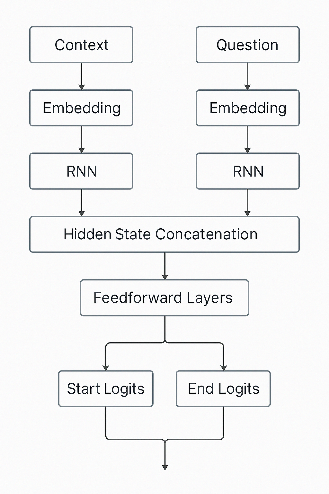

# Milestone 2 
## Abstract

In this project, we build a question answering (QA) system using a deep learning model. The system takes a question and a related paragraph (context) as input and tries to find the correct answer from the paragraph. We use a filtered version of the SQuAD 2.0 dataset that includes only 20,000 answerable question-context-answer examples. The goal is to train a model that can predict the start and end of the answer span in the context. We are limited to using only three layers in our model (excluding input and output layers), and we experiment with different types of models such as RNNs, LSTMs, GRUs, and attention-based networks. This report explains how we prepared the data, designed the model, trained it, and evaluated the results. We also discuss what worked well, what was challenging, and how the system could be improved in the future.

**Keywords:** Question Answering, SQuAD 2.0, Deep Learning, LSTM, Attention.

## 1. Introduction

Question Answering (QA) is an important task in Natural Language Processing (NLP), where a system tries to find the answer to a question based on a given text (called the context). QA models are used in many real-world applications like search engines, virtual assistants, and chatbots. In this project, we focus on extractive question answering, where the answer must be a continuous span of text taken directly from the context.

We use a subset of the SQuAD 2.0 dataset, which is one of the most widely used benchmarks for QA tasks. It was one of several datasets suggested for this project, and we chose it because of its popularity and relevance to real-world QA problems. We filtered the dataset to include only 20,000 answerable question-context-answer examples.

As a starting point, we experimented with a simple setup where the model tries to answer questions without using any context. As expected, the model struggled to perform well, which confirmed the importance of including context information in extractive QA systems.

We implemented multiple models using PyTorch, including LSTM-based, GRU-based, and attention-based architectures. We used the HuggingFace `tokenizers` library for efficient text preprocessing. Our model designs were restricted to a maximum of three layers (excluding input and output), and we were instructed to use either RNNs or attention-based models—but not a combination of both. However, through a brief literature review, we found that combining RNNs with attention mechanisms often gives better results, especially in small-scale models like ours.

Another challenge was the limited computational resources available, which made it difficult to experiment with larger models or perform many training iterations. Despite these constraints, we aimed to build a functional and reasonably accurate QA system.

This report describes how we processed the data, built and trained the models, evaluated their performance, and what we learned from the process. We also discuss the limitations of our approach and propose directions for future improvements.

## 2. Literature Review

The Stanford Question Answering Dataset (SQuAD), introduced by Rajpurkar et al. (2016), has been a central benchmark for evaluating extractive question answering (QA) systems. It consists of over 100,000 questions created from Wikipedia articles, where the task is to extract the correct span from a given context. The dataset’s design has encouraged a range of model architectures over the years—starting with recurrent neural networks (RNNs) and gradually moving toward attention-based models and transformer architectures.

### 2.1 RNN-Based Approaches

Initial attempts to solve the SQuAD task mainly used RNNs like LSTMs and GRUs due to their ability to model sequential dependencies. For example, the Match-LSTM model by Wang and Jiang (2016) used an LSTM to align the question and context, followed by a pointer network to predict the start and end of the answer span. The idea was to compute attention-weighted representations of the passage conditioned on the question, which helped the model focus on relevant information.

Another early model, BiDAF (Seo et al., 2016), also relied on LSTMs but introduced a bi-directional attention mechanism that allowed interaction in both directions—context to question and question to context. This helped the model generate more informed representations of the input, leading to better span predictions.

Bidirectional GRUs have also been used as a lighter alternative to LSTMs. Mishra (2022), for example, proposed a model based on Bi-GRUs with attention layers for SQuAD 2.0, which includes unanswerable questions. Their architecture could both predict answer spans and assess whether a question has an answer at all, although exact performance scores weren’t reported.

In another example, Hu et al. (2018) proposed a model that combined Bi-LSTMs with co-attention mechanisms and a boundary decoder for span prediction. Their model performed competitively and showed how combining attention with recurrent encoders could boost accuracy.

### 2.2 Attention-Based and Transformer Models

As attention mechanisms became more central in NLP, models began to rely more on them, reducing or even eliminating the need for recurrence. While models like BiDAF already used attention, the introduction of transformers made it possible to model dependencies across the entire sequence in parallel, using only self-attention.

One of the most impactful transformer-based models is BERT (Devlin et al., 2018). BERT is a pre-trained transformer that was fine-tuned on SQuAD, and it quickly set new benchmarks. Its ability to model bidirectional context using self-attention proved very effective for extractive QA tasks. BERT achieved significantly higher scores than previous RNN-based models and has since become a strong baseline in the field.

Since BERT, many improved models have been proposed. These include larger or more specialized transformer architectures, often using techniques like ensemble methods, knowledge distillation, or adversarial training. Many of these models have surpassed human-level performance on the SQuAD leaderboard, especially in SQuAD 1.1 and 2.0.

### 2.3 Summary

The progression of QA models on SQuAD reflects a clear shift from sequence-based models like LSTMs and GRUs to attention-dominant architectures and finally to transformers. While our project was restricted to using either RNNs or attention-based models—not both—the literature suggests that combining these techniques can lead to improved performance, particularly for smaller models. This context helped inform the design choices in our own model development.

## 3. Data Preprocessing

Effective data preprocessing was a crucial part of our pipeline to ensure the model could handle the input format correctly and learn from the SQuAD 2.0 dataset under our project constraints.

### 3.1 Dataset Preparation

We used the SQuAD 2.0 dataset, which includes both answerable and unanswerable questions. For our task, we focused only on answerable questions. The dataset was downloaded in JSON format from the official website and parsed using custom Python scripts.

To reduce training time and memory usage, we sorted all answerable examples by context length and selected the 20,000 shortest ones. Each example included a question, a context paragraph, and the ground truth answer span (given as character-level start and end positions within the context).

### 3.2 Tokenization

We used **Byte Pair Encoding (BPE)** to tokenize the text. A vocabulary of 10,000 subword tokens was generated from the dataset using HuggingFace's `tokenizers` library. This was appropriate given that the dataset had approximately 90,000 unique raw words. BPE allowed us to break rare or unknown words into more frequent subword units, reducing the effective vocabulary size while still capturing meaningful tokens.

All text was lowercased as part of preprocessing. We avoided removing punctuation or other characters, since the ground truth answer spans in SQuAD are given as character-level indices. Any modification of the text could invalidate these indices and cause incorrect training labels.

### 3.3 Input Construction

Each input sequence was constructed by concatenating the tokenized question and context with special tokens in the following format:

**[SOS] question tokens [SEP] context tokens [SEP]**

We used the following special tokens throughout preprocessing:

- **[UNK]** — Represents unknown tokens not in the vocabulary.
- **[PAD]** — Used to pad shorter sequences to match a fixed length. These tokens are masked out during training.
- **[MASK]** — Included in the vocabulary for completeness, though not used in this task.
- **[SOS]** — Marks the beginning of a sequence.
- **[EOS]** — Marks the end of a sequence. Not strictly needed for extractive QA, but included for consistency.
- **[SEP]** — Separates the question and the context in the input sequence.

For example, a sample input could look like:

**[SOS] What is the capital of France? [SEP] France is a country in Europe. Its capital is Paris. [SEP]**

### 3.4 Truncation and Padding

Inputs longer than the model’s maximum allowed sequence length were **truncated** from the end of the context. This was necessary due to GPU memory constraints and to maintain a consistent input size. Shorter sequences were **padded** with the `[PAD]` token.

To avoid the model attending to these padded positions during training and evaluation, we applied **attention masks**. These masks assign a weight of 0 to `[PAD]` tokens and 1 to all valid tokens, ensuring the model only learns from meaningful parts of the input.

### 3.5 Label Processing

Since the original dataset provides **character-level start and end indices** of the answer in the context, we had to convert these into **token-level indices** after tokenization.

This was done by:

1. Tokenizing the context separately.
2. Mapping the character-based start and end positions of the answer to the corresponding tokens.
3. Adjusting the indices to align with the combined `[SOS] question [SEP] context` input.

During training, the model learns to predict these token indices as the start and end positions of the answer.

### 3.6 Dataset Splits and Batching

We used the original **training and development (dev)** splits provided in SQuAD 2.0 and applied our filtering strategy to both sets to keep only answerable examples. These filtered sets were then used for training and validation respectively.

We trained using a **batch size of 32**, and all sequences in a batch were padded to the same length to enable efficient parallel computation. Padding masks were used to ensure correct attention and loss computation.

To efficiently handle the data during training, we implemented a **custom PyTorch Dataset class** that inherits from `torch.utils.data.Dataset`. This class handles preprocessing on-the-fly and returns the model inputs and labels in a consistent format. We then used **PyTorch DataLoaders** to create batches, shuffle the training data, and manage parallel data loading during training and evaluation.

### 3.7 Libraries and Tools

We used the following tools in our preprocessing pipeline:

- **HuggingFace Tokenizers** — For BPE-based tokenization and handling special tokens.
- **Custom Python scripts** — For loading and filtering the dataset, mapping character indices to token indices, and constructing input sequences with proper masks.
- **PyTorch Dataset and DataLoader** — For batching, shuffling, and parallelized data loading.

## 4. Model Architectures

In this section, we describe the different neural network architectures we implemented for extractive question answering on the SQuAD dataset. All models take as input a tokenized question and context pair and predict the start and end indices of the answer span within the context. The input is preprocessed as described earlier and fed into the models using the same training and evaluation pipeline. We experimented with four different architectures, each using either RNN-based or attention-based mechanisms. Below, we describe each architecture in detail.

### 4.1 Dual-RNN with Final State Concatenation

This model processes the question and context independently using two separate RNN encoders. Unlike attention-based models, it summarizes each input sequence using the final hidden state of its respective RNN. The final hidden states of both the question and context are concatenated and passed through a feed-forward network to predict the start and end positions.

#### Architecture Overview

- **Separate Embedding Layers**: Independent embeddings for the context and question inputs. Optionally initialized with pretrained vectors and can be frozen during training.
- **Dual RNN Encoders**: Separate RNN (LSTM/GRU/RNN) modules for the context and question, allowing flexible experimentation. The outputs of these encoders are not used directly—only their final hidden states are kept.
- **Hidden State Concatenation**: The final forward and backward hidden states (if bidirectional) from both RNNs are concatenated, resulting in a single fixed-size vector summarizing both inputs.
- **Feedforward Layers**: A two-layer MLP uses the combined representation to produce logits for the start and end positions.

    

#### Input & Output

- **Inputs**: 
  - `context` (LongTensor): Tokenized context sequence.
  - `question` (LongTensor): Tokenized question sequence.
- **Outputs**:
  - `start_logits`, `end_logits`: Logits over the context, computed from the combined hidden states.

#### Model Highlights

- Unlike token-level models, this architecture **summarizes the entire context and question** into single fixed-size vectors before answer prediction.
- The model is lightweight and efficient, making it a good baseline for comparing the effectiveness of fine-grained attention mechanisms.
- It supports configurable RNN types (LSTM, GRU, or vanilla RNN) and optionally pretrained embeddings.

### 4.2 Cross-Attention Transformer Model (TransformerQAModel2)

This model adopts a different approach inspired by encoder-decoder architectures, specifically focusing on how the context representation can be enriched by attending to the question. Instead of concatenating the context and question into a single sequence, this model processes them separately initially and then uses cross-attention mechanisms.

#### Architecture Overview

- **Embedding Layer**: Both the context and the question tokens are independently embedded using token embeddings and positional embeddings. Dropout is applied to the combined embeddings.
- **Question Encoder**: The embedded question sequence is passed through a Transformer Encoder block (a stack of self-attention and feed-forward layers). This generates a contextualized representation for each token in the question.
- **Cross-Attention Layers**: The context representations act as *queries*, while the encoded question representations act as *keys* and *values*. A multi-head attention mechanism calculates how much each context token should attend to the question tokens. The output of the attention is added to the context representation via a residual connection, followed by layer normalization. A feed-forward network is applied, again followed by a residual connection and layer normalization. This process is repeated for the specified number of cross-attention layers.
- **Output Heads**: After passing through the cross-attention layers, the final context representations are fed into two separate linear layers to produce the start and end logits for each token position in the context.
- **Masking**: Padding tokens in the input question are masked during the question encoding and cross-attention steps. Padding tokens in the input context are masked in the final output logits to prevent them from being selected as start or end points.

#### Input & Output

- **Inputs**: 
  - `context` (LongTensor): Tokenized context sequence.
  - `question` (LongTensor): Tokenized question sequence.
  - `attention_mask_context` (Tensor): Optional mask to ignore padding tokens in the context during attention.
  - `attention_mask_question` (Tensor): Optional mask to ignore padding tokens in the question during attention.
- **Outputs**: 
  - `start_logits`, `end_logits`: Logits over the context tokens indicating the predicted start and end positions.

#### Model Highlights

- The model uses **cross-attention** to explicitly model the interaction between the context and the question.
- Padding in both the context and the question is properly masked during attention computation.
- The architecture is modular, allowing for flexible configuration of the number of cross-attention layers and Transformer encoder layers.
- It maintains token-level alignment between the context and the question, ensuring fine-grained predictions.
- The use of residual connections and layer normalization ensures stable training and better gradient flow.

### 4.3 DrQA-Inspired BiLSTM Model

This model is a simplified version of the DrQA Document Reader. It uses separate bidirectional LSTM encoders for the question and the context, followed by a dot-product attention mechanism and a pointer network to extract the answer span.

#### Architecture Overview

- **Embedding Layer**: Maps input token indices to dense vectors. Padding tokens are handled using `padding_idx`.
- **BiLSTM Encoders**: Two separate BiLSTM networks encode the context and the question independently. Each has 3 layers, a hidden size of 128, and dropout applied for regularization.
- **Dot-Product Attention**: Calculates a similarity matrix between context and question encodings to capture alignment between them.
- **Fusion Layer**: The attention-weighted question representation is concatenated with the context encoding to form the fused representation.
- **Pointer Network**: Two MLPs predict the start and end positions of the answer from the fused representation.

#### Input & Output

- **Inputs**: 
  - `context` (LongTensor): Tokenized context sequence.
  - `question` (LongTensor): Tokenized question sequence.
  - `attention_mask_question` (Tensor): Optional mask to ignore padding tokens in the question during attention.
- **Outputs**: 
  - `start_logits`, `end_logits`: Logits over the context tokens indicating the predicted start and end positions.

#### Model Highlights

- The model uses **dot-product attention** to focus on relevant parts of the question while reading the context.
- Padding in the question is properly masked during attention computation.
- The architecture is lightweight and works within hardware constraints.
- It avoids summarizing the input too early and maintains token-level alignment between context and question.

### 4.4 Bi-Directional Attention Flow (BiDAF) Model

The BiDAF model is a widely recognized architecture for machine comprehension tasks. It explicitly models the interaction between the context and the question using bi-directional attention mechanisms. This allows the model to focus on the most relevant parts of the context for answering the question.

#### Architecture Overview

- **Embedding Layer**: Converts word indices into dense vector representations using an embedding layer. Pretrained embeddings (e.g., GloVe) can be used for better initialization. Dropout is applied to the embeddings for regularization.
- **Contextual Encoder**: A BiLSTM processes the embedded context and question sequences independently. It outputs contextualized representations of the context and question, each with a dimensionality of `2 * hidden_size`.
- **Attention Flow Layer**:
  - **Context-to-Query (C2Q) Attention**: For each context word, attends over all query words to identify the most relevant parts of the question.
  - **Query-to-Context (Q2C) Attention**: For each query word, computes its maximum similarity with all context words and uses this to attend over the context.
  - Combines the original context representation with the attended vectors to form an augmented representation `G` of shape `(batch, c_len, 8 * hidden_size)`.
- **Modeling Layer**: A 2-layer BiLSTM processes the attention output `G` to produce a refined representation `M` of shape `(batch, c_len, 2 * hidden_size)`.
- **Output Layer**:
  - Computes the start and end logits for the answer span:
    - Concatenates `G` and `M` to predict the start logits.
    - Passes `M` through an additional BiLSTM to produce `M2`, which is concatenated with `G` to predict the end logits.
  - Uses linear layers to compute the logits for each token in the context.

#### Input & Output

- **Inputs**:
  - `context` (Tensor): Tokenized context sequence of shape `(batch, c_len)`.
  - `question` (Tensor): Tokenized question sequence of shape `(batch, q_len)`.
- **Outputs**:
  - `start_logits` (Tensor): Logits over the context tokens indicating the predicted start position of the answer.
  - `end_logits` (Tensor): Logits over the context tokens indicating the predicted end position of the answer.

#### Model Highlights

- The BiDAF model uses **bi-directional attention** to explicitly model the interaction between the context and the question.
- The **Context-to-Query (C2Q) Attention** helps the model focus on the most relevant parts of the question for each context word.
- The **Query-to-Context (Q2C) Attention** ensures that global information from the context is incorporated into the representation.
- The architecture is modular, with separate layers for embedding, attention, modeling, and output, making it easy to extend or modify.
- The use of residual connections and dropout ensures stable training and reduces overfitting.
- The model is designed to handle variable-length inputs, with padding tokens properly masked during computations.
